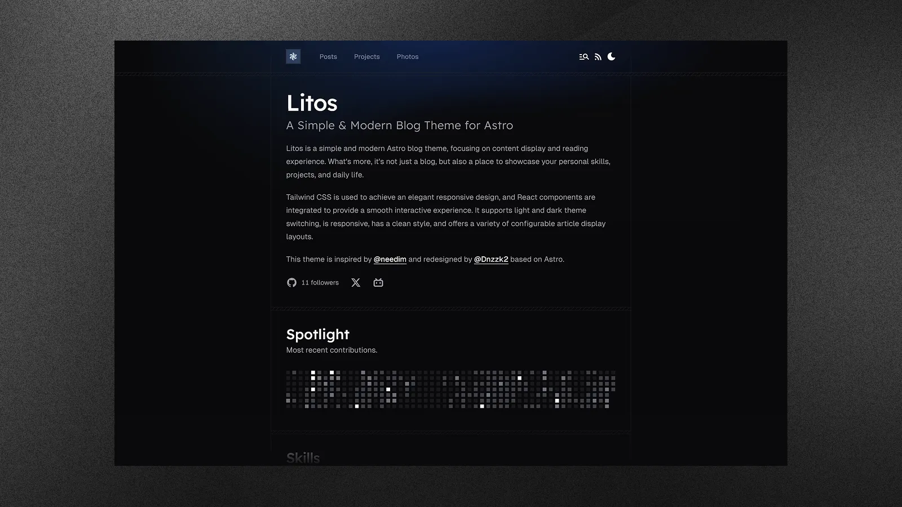

<div align="center">


**A modern, elegant, and performance-focused blogging theme built for developers.**

**English** | [简体中文](./README.zh-CN.md)

[Demo](https://litos.vercel.app/) · [Report Bug](https://github.com/ndEX/Litos/issues) · [Request Feature](https://github.com/ndEX/Litos/issues)

</div>

## Introduction

Litos is a comprehensive blogging theme crafted with **Astro**, **React**, and **TailwindCSS**. It is designed to provide developers with a clean, professional, and highly customizable platform to showcase their work, thoughts, and photography.

Unlike traditional themes, Litos emphasizes visual aesthetics without compromising on performance. It features fluid animations, a polished design system, and a robust set of built-in components to help you build your personal brand effectively.



## Key Features

- **Modern Architecture** — Astro 5 + React 19 for blazing fast performance and dynamic interactivity.
- **Elegant Design** — Fully responsive, meticulously crafted UI with TailwindCSS 4.
- **Posts** — Multiple layout options (compact, cover image) with rich Markdown support.
- **Code Highlighting** — Integrated Expressive Code for beautiful syntax highlighting.
- **Math Support** — KaTeX for rendering mathematical equations.
- **SEO** — Built-in sitemaps, robots.txt, and meta tags.
- **Analytics** — Configurable Vercount and Umami analytics.
- **Dark Mode** — Native light and dark theme support.

## Deploy

Deploy your own Litos blog with one click:

[](https://vercel.com/new/clone?repository-url=https://github.com/ndEX/Litos)
[](https://app.netlify.com/start/deploy?repository=https://github.com/ndEX/Litos)

## Getting Started

### Prerequisites

- **Node.js** (v18 or higher)
- **pnpm** (recommended)

### Installation

1.  **Clone the repository**

    ```bash
    git clone https://github.com/ndEX/Litos.git
    cd Litos
    ```

2.  **Install dependencies**

    ```bash
    pnpm install
    ```

3.  **Start the development server**

    ```bash
    pnpm dev
    ```

    Your site should now be running at `http://localhost:4321`.

## Configuration

Content and theme behavior are split across:

- `src/content/site.json` for site metadata, homepage content, navigation links, hero metric, and social links
- `src/config.ts` for theme behavior and posts configuration

### Site Settings
```json
{
  "default": {
    "site": {
      "title": "Litos",
      "description": "Your site description here.",
      "website": "https://your-domain.com",
      "author": "Your Name"
    }
  }
}
```

### Navigation
Header and footer links can be managed via `headerLinks` and `footerLinks` in `src/content/site.json`.

## Scripts

| Script | Description |
| :--- | :--- |
| `pnpm dev` | Starts the local development server. |
| `pnpm build` | Builds the site for production. |
| `pnpm preview` | Previews the built production site locally. |
| `pnpm format` | Formats code using Prettier. |
| `pnpm check` | Runs Astro check for diagnostics. |

### Local Audit

For local performance audits, the command commonly used in this workspace is:

```bash
ndex-audit-local
```

This is a **global environment command**, not a script versioned inside this repository. If it is missing on a machine, inspect it with:

```bash
type ndex-audit-local
```

The repository itself does not currently define this command in `package.json`.

## License

Distributed under the MIT License. See [MIT LICENSE](LICENSE) for more information.

## Star History

<a href="https://www.star-history.com/#ndEX/Litos&type=date&legend=top-left">
 <picture>
   <source media="(prefers-color-scheme: dark)" srcset="https://api.star-history.com/svg?repos=ndEX/Litos&type=date&theme=dark&legend=top-left" />
   <source media="(prefers-color-scheme: light)" srcset="https://api.star-history.com/svg?repos=ndEX/Litos&type=date&legend=top-left" />
   
 </picture>
</a>

---

<p align="center">
made with 💗 by <a href="https://github.com/ndEX">ndEX</a> !
</p>
